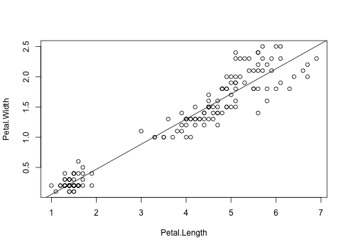

## Rとは

* オープンソース・フリーソフトウェアの統計解析向けのプログラミング言語
* 最小限の労力で見通しよく解析するために工夫された命令体系
* 視覚化に優れたグラフ機能、多くの画像フォーマット・商業印刷品質で出力可能
* Excelやcvsデータの読み込み可能
* 大規模遺伝子発現プロファイルなどを解析するような学術利用実績あり

(WikiPediaより)  


--- .class #id 

## とりあえず使ってみる
### 値の代入

```
> a <- 5
> d <- "abc"

> a
[1] 5

> d
[1] "abc"
```
※ 代入には「=」も使えるが、Rは慣例的に「<-」を使う。

--- .class #id 

### ベクトル

「c」を使う
```
> a <- c(1,2,3)
> a
[1] 1 2 3
> b <- c(4,5,6)
> a+b
[1] 5 7 9
```
※ 「c」は適当な変数としては使わない

--- .class #id 

### 行列
「matrix」を使う  
3行4列の行列に1から12までの数値が入っている例
```
> matrix(1:12,3,4)
     [,1] [,2] [,3] [,4]
[1,]    1    4    7   10
[2,]    2    5    8   11
[3,]    3    6    9   12

> a <- matrix(1:12,3,4)
> a
     [,1] [,2] [,3] [,4]
[1,]    1    4    7   10
[2,]    2    5    8   11
[3,]    3    6    9   12

```
[(行),(列)]です

--- .class #id 

値の取り出しと計算
```
> a[1,]
[1]  1  4  7 10

> a[,1]
[1] 1 2 3

> a[1,1]
[1] 1

> a[1,1] * a[1,2]
[1] 4

> a[3,1] * a[1,2]
[1] 12
```

--- .class #id 

任意の行列を作るときはrbind,cbindを使う

```
> x <- rbind(c(1,3,6,9),
+ c(5,10,7,2))
> x
     [,1] [,2] [,3] [,4]
[1,]    1    3    6    9
[2,]    5   10    7    2

> x <- cbind(c(1,3,6,9),
+ c(5,10,7,2))
> x
     [,1] [,2]
[1,]    1    5
[2,]    3   10
[3,]    6    7
[4,]    9    2
```
「+」はプロンプトです。この程度であれば1行にすべて書いても問題ないですね。


--- .class #id 

アヤメのガクヘン(蕚片)と花びらに関するデータでRのサンプルデータとして有名  
なiris(詳細は最後の参考リンクを参照)

```
> iris
    Sepal.Length Sepal.Width Petal.Length Petal.Width    Species
1            5.1         3.5          1.4         0.2     setosa
2            4.9         3.0          1.4         0.2     setosa
...

> summary(iris)
  Sepal.Length    Sepal.Width     Petal.Length    Petal.Width  
 Min.   :4.300   Min.   :2.000   Min.   :1.000   Min.   :0.100 
 1st Qu.:5.100   1st Qu.:2.800   1st Qu.:1.600   1st Qu.:0.300 
 Median :5.800   Median :3.000   Median :4.350   Median :1.300 
 Mean   :5.843   Mean   :3.057   Mean   :3.758   Mean   :1.199 
 3rd Qu.:6.400   3rd Qu.:3.300   3rd Qu.:5.100   3rd Qu.:1.800 
 Max.   :7.900   Max.   :4.400   Max.   :6.900   Max.   :2.500 
       Species 
 setosa    :50 
 versicolor:50 
 virginica :50 
```

--- .class #id 

```
> sum(iris[,1])  合計
[1] 876.5

> mean(iris[,1])　平均
[1] 5.843333

> sd(iris[,1])　　標準偏差
[1] 0.8280661

> max(iris[,1])　最大
[1] 7.9

> min(iris[,1])　最小
[1] 4.3
```

--- .class #id 

相関
```
> cor(iris[,1:4])
             Sepal.Length Sepal.Width Petal.Length Petal.Width
Sepal.Length    1.0000000  -0.1175698    0.8717538   0.8179411
Sepal.Width    -0.1175698   1.0000000   -0.4284401  -0.3661259
Petal.Length    0.8717538  -0.4284401    1.0000000   0.9628654
Petal.Width     0.8179411  -0.3661259    0.9628654   1.0000000 

> cor(iris＄Petal.Length, iris＄Petal.Width)
[1] 0.9628654
```

0に近いほど相関が無い。同じもの同士の相関は1になる。  
Petal.LengthとPetal.Widthは正の相関がある。

--- .class #id 
グラフ化


```r
plot(iris$Petal.Length, iris$Petal.Width)
```

 


```
plot(iris[,3:4]) と同じ
```

--- .class #id 
lm関数を使った回帰分析

```
> iris.lm <- lm( Petal.Width ~ Petal.Length, data=iris[,3:4] ) 
> summary(iris.lm)

Call:
lm(formula = Petal.Width ~ Petal.Length, data = iris[, 3:4])

Residuals:
     Min       1Q   Median       3Q      Max 
-0.56515 -0.12358 -0.01898  0.13288  0.64272

```

--- .class #id 

```
Coefficients:
              Estimate Std. Error t value Pr(>|t|)    
(Intercept)  -0.363076   0.039762  -9.131  4.7e-16 ***
Petal.Length  0.415755   0.009582  43.387  < 2e-16 ***
---
Signif. codes:  0 ‘***’ 0.001 ‘**’ 0.01 ‘*’ 0.05 ‘.’ 0.1 ‘ ’ 1

Residual standard error: 0.2065 on 148 degrees of freedom
Multiple R-squared:  0.9271,	Adjusted R-squared:  0.9266 
F-statistic:  1882 on 1 and 148 DF,  p-value: < 2.2e-16
```

Estimateのところが係数など。この例では Petal.Widthをy, Petal.Lengthをxとして回帰式は  
y = 0.415755x - 0.363076 
となります。
(詳細は最後の参考リンクを参照)

--- .class #id 
図示


```r
iris.lm <- lm(Petal.Width ~ Petal.Length, data = iris[, 3:4])
plot(Petal.Width ~ Petal.Length, data = iris[, 3:4])
abline(iris.lm)
```

 


--- .class #id 

終わりですm(_ _)m  


### 参考

seekR (Rに関する検索がやりやすい)  
http://seekr.jp

irisについて  
http://monge.tec.fukuoka-u.ac.jp/r_analysis/analysis_iris00.html  

Rで線形単回帰分析  
http://d.hatena.ne.jp/matsuou1/20110418/1303144024  


--- .class #id 
おまけ
## rCharts
グリグリ動く図が書ける。

インストール
```
sudo でRを起動
% sudo r

> options(repos="http://cran.r-project.org/")
→ミラーサイトだと失敗することがあるのでとりあえず本家を設定

> install.packages("devtools")
> library(devtools)
> install_github('rCharts', 'ramnathv')
```

--- .class #id 
使ってみる

```
※一旦Rを出て一般ユーザで実行
> q()
% r

> library(rCharts)
> x<-subset(as.data.frame(HairEyeColor),Sex=="Male")
> nPlot(Freq~Hair,group="Eye",data=x,type='multiBarChart')
```

--- .class #id 
おまけ2
## Slidify
このプレゼン資料はこれで作ってます。  

インストール
```
sudo でRを起動
% sudo r

> options(repos="http://cran.r-project.org/")
> install.packages("devtools")   <- ※rChartsでインストール済みの場合は不要
> library(devtools)
> install_github('slidify','ramnathv')
> install_github('slidifyLibraries','ramnathv')
```

--- .class #id 
使い方  

```
※一旦Rを出て一般ユーザで実行
> q()
% r

> library(slidify)
> library(slidifyLibraries)
> author("slidify_test")
```
エディタが起動するので適当に編集して保存して
```
> slidify("index.Rmd")
```
これでindex.htmlができるのでブラウザでアクセスする。

--- .class #id 

編集は別ターミナルでindex.Rmdをエディタで編集し、
Rを起動しているターミナルで
```
> slidify("index.Rmd")
```
を実行する。  
(もっとスマートなやり方がありそう)

--- .class #id 

おまけも終わりですm(_ _)m  


### 参考

rCharts  
http://rcharts.io  

Slidify  
http://slidify.org  

R上でスライド作成  
http://qh73xe.jimdo.com/プロット/パッケージslidify/  

可視化周辺の進化がヤヴァイ  
http://www.slideshare.net/teramonagi/tokyo-r31-20130601  

